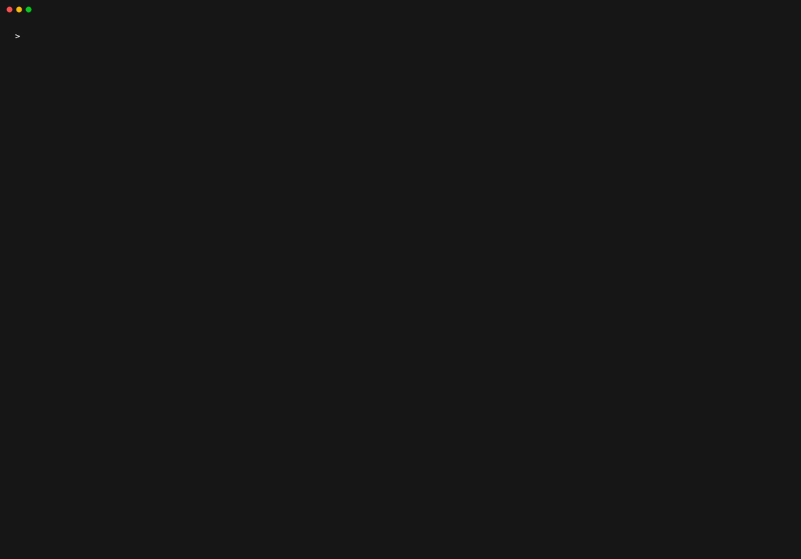

# agentsurface

**What AI agent machinery is installed on this machine, and who put it there.**

```sh
brew install Northbeams-Labs/tap/agentsurface
agentsurface
```



<sub>One real run, unedited. The machine it reads is
[invented on purpose](docs/demo/README.md), because a recording of a real one
would publish somebody's laptop. On a working laptop the counts are higher:
92 items across 7 categories on the one this was built on.</sub>

One command, and no account, no network call, and nothing uploaded. It reads
local configuration and lists what it finds: model context protocol servers
across every client it knows, desktop extensions, plugins, skills, connectors,
scheduled agent tasks, instruction files, and AI-aware browser extensions. For
each one it records where it came from, who published it according to its own
manifest, and what its declared configuration says it can reach.

The count is usually higher than expected, and the reason is structural rather
than anybody's fault. Agent tooling arrives one approval at a time, from a
client install, from a repository that carries its own configuration, from a
plugin that pulled in others, and nothing on the machine has ever added it up.

It reads. It does not judge, and it does not act.

Other installs: [Go, signed binaries, and from source](#install).

## What it refuses to do

These are enforced or settled, not aspirations.

- No network calls of any kind. Not for telemetry, version checks, catalogue
  lookups, crash reports or model calls. CI checks this on every push, and a
  release cannot ship if the check fails. See [PRIVACY.md](PRIVACY.md) and
  [`.github/workflows/no-network.yml`](.github/workflows/no-network.yml).
- No account, no token, no sign-up, no licence key.
- No upload. Nothing found on your machine leaves your machine.
- It never executes anything it finds. It will read the configuration that says
  how an MCP server starts; it will not start it. The compiled binary cannot
  start a process at all, because `os/exec` is on the denied list in the same CI
  check.
- It never opens browsing data. No history, cookies, local storage, saved
  passwords or profile identities. Extension manifests and native messaging host
  manifests, and nothing else.
- No risk score, no grade, no letter rating. A score would be a claim we could
  not defend line by line.
- It writes one file, a local baseline of hashes at
  `~/.config/agentsurface/baseline.json`, and `--no-baseline` switches that off.

## What this does not do

This section is here rather than at the bottom because it is the part that
decides whether the tool is any use to you.

1. It does not tell you whether anything it finds is safe. It is an inventory.
   `not in catalogue` means the catalogue snapshot inside the binary has no
   entry for that item. It does not mean anything is wrong with it.
2. It does not detect prompt injection, and does not attempt to. Where it
   reports that an instruction file contains a particular kind of wording, that
   is an observation about text.
3. It reads local files only. A connector attached inside a vendor account, an
   agent running in a cloud workspace, or anything else that leaves nothing on
   this disk is invisible to it. It makes no network calls, so it cannot go and
   ask.
4. Catalogue matching is only as fresh as the binary. The snapshot ships inside
   the release.
5. It only finds paths somebody has told it about. There is no registry of agent
   configuration. Every path in the tool came from a vendor's documentation or
   from a real install, and clients change. A path that is wrong finds nothing
   and says nothing, which looks exactly like a clean machine.
6. It reports what a configuration declares, not what code does. An extension
   that declares nothing can still shell out at runtime.
7. It cannot see whether a browser extension is switched on, because that state
   lives in browser databases it deliberately does not open.

Every run prints its own blind spots in a section headed "What this did not look
at", so the limitations are in front of you at the moment they matter rather
than in a file you would have to go and find.
[docs/DETECTIONS.md](docs/DETECTIONS.md) is the standing version, per detector.

## Install

Version 0.1.0 is released, for macOS and Linux.
[docs/VERIFY.md](docs/VERIFY.md) is how you check that what you downloaded is
what this repository's release workflow built.

**On Windows**, use the `go install` line below for now. v0.1.0 has no Windows
archive; the release pipeline now builds and Authenticode signs one, so the next
release will. The detectors have known the Windows paths all along.

**1. Homebrew**

```sh
brew install Northbeams-Labs/tap/agentsurface
```

**2. Go**

```sh
go install github.com/Northbeams-Labs/agentsurface/cmd/agentsurface@latest
```

This is the one that works on Windows. Requires Go 1.26 or newer. The Go
toolchain checks what it downloads against
`go.sum` and the public checksum database, which proves you got the same bytes
as everyone else. It does not prove the bytes are safe. Nothing does that except
reading them.

**3. Signed binaries from GitHub Releases**

Download the archive for your platform from the
[releases page](https://github.com/Northbeams-Labs/agentsurface/releases), then
verify it before you run it. [docs/VERIFY.md](docs/VERIFY.md) has
copy-pasteable commands for the checksums, the cosign signature over them, and
the build provenance attestation, plus how to rebuild the binary from source and
confirm you get the same bytes.

macOS and Linux archives are published for v0.1.0. The Windows archive arrives
with the next release, Authenticode signed; until then `go install` is the
Windows route.

**From source**

```sh
git clone https://github.com/Northbeams-Labs/agentsurface
cd agentsurface
make build      # writes ./bin/agentsurface
make verify     # runs the no-network check yourself
```

## Use

```sh
agentsurface                  # readable summary
agentsurface --verbose        # the same, plus what each item declares
agentsurface --json           # machine-readable
agentsurface --no-baseline    # do not read or write the local drift baseline
agentsurface --version
```

## What the output looks like

An example, with the paths and names changed:

```
agentsurface v0.1.0  darwin
4 items found across 3 categories

AI browser extensions (1)
  Example Assistant                Google Chrome, example.com, can reach: browser_tabs clipboard, not in catalogue
                                   ~/Library/Application Support/Google/Chrome/Default/Extensions/abcdefghijklmnop/2.4.1_0/manifest.json

Instruction files (1)
  AGENTS.md                        agents.md clients, not in catalogue
                                   ~/code/checkout-service/AGENTS.md

Model context protocol servers (2)
  filesystem                       Claude Desktop, can reach: shell filesystem
                                   ~/Library/Application Support/Claude/claude_desktop_config.json
  internal-deploy-tools            Cursor, can reach: shell network, not in catalogue
                                   ~/code/checkout-service/.cursor/mcp.json

6 notes about what these items declare are not shown. Run with -verbose for them.

Changed since the last run (1)
  internal-deploy-tools            ~/code/checkout-service/.cursor/mcp.json

Could not read (1)
  browsers: ~/Library/Application Support/Firefox/Profiles permission denied

What this did not look at
  browser extensions: classification: extensions are judged on what they declare, not on what their code does
  remote and cloud hosted servers: a server connected inside a vendor account leaves nothing on this disk
  running processes: this reads configuration files only

This tool inventories what is installed. It does not judge whether any of it is safe.
```

The second line of each item is the path, so you can go and read the file
yourself rather than believing the summary.

`--verbose` prints the notes under each item: the permissions and host access an
extension declares, the native messaging hosts that name it, why a detector
reported it at all. On a machine with real agent tooling on it there are
hundreds of them, which is why the default counts them instead of printing them.

"Could not read" is not noise. A permission error means part of the machine was
not inventoried, and the run says so instead of quietly returning a smaller
number.

"What this did not look at" prints on every run, including the ones that went
perfectly. It is how you tell "nothing is installed" apart from "nothing was
looked at".

[docs/OUTPUT.md](docs/OUTPUT.md) documents both formats, including every field
of the JSON.

## Drift

When a run finishes, `agentsurface` writes a hash for each item it found to
`~/.config/agentsurface/baseline.json`. A later run compares against it and
reports anything whose declared definition changed. That covers the case where a
tool you already approved was quietly redefined underneath you.

The file holds hashes and the paths they belong to. It never holds file
contents, and it never leaves the machine. Delete it whenever you like, or pass
`--no-baseline` to neither read nor write it. See [PRIVACY.md](PRIVACY.md).

## What it reads on your machine

Local configuration belonging to AI agent tooling: client configuration files,
extension and plugin directories, skill and connector definitions, instruction
files, and browser extension and native messaging host manifests. Plus any
project directory you point it at, a few levels down, for configuration a
repository carries with it.

[docs/DETECTIONS.md](docs/DETECTIONS.md) lists the paths per detector, and the
gaps alongside them.

## Documentation

| | |
|---|---|
| [docs/DETECTIONS.md](docs/DETECTIONS.md) | What each detector reads, and what it misses |
| [docs/OUTPUT.md](docs/OUTPUT.md) | The text and JSON output shapes |
| [docs/VERIFY.md](docs/VERIFY.md) | How to verify a release, and how to reproduce the build |
| [PRIVACY.md](PRIVACY.md) | What is stored, where, and how to switch it off |
| [SECURITY.md](SECURITY.md) | Reporting a vulnerability, and what we commit to |
| [CONTRIBUTING.md](CONTRIBUTING.md) | DCO sign-off, running the tests, adding a detector |
| [SUPPORT.md](SUPPORT.md) | Where to take a question |

## Contributing

Bug reports and missed detections are the most useful thing this project gets.
Contributions use Developer Certificate of Origin sign-off (`git commit -s`),
and there is no contributor licence agreement. One person reviews.
[CONTRIBUTING.md](CONTRIBUTING.md) has the detail, including the list of things
that are settled decisions rather than open questions.

## Licence

Apache License 2.0. See [LICENSE](LICENSE) and [NOTICE](NOTICE). The licence
grants no rights to the names or logos; see [TRADEMARK.md](TRADEMARK.md).

---

agentsurface is published by Northbeams Labs, the research imprint of Northbeams.
<https://labs.northbeams.com>
